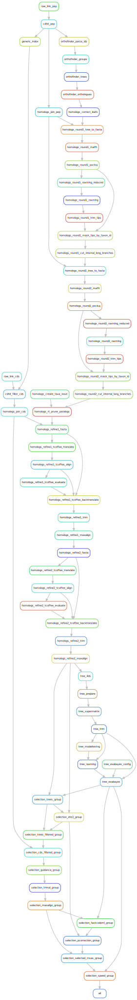

# smsk_orthofinder: A Snakemake pipeline to find orthologs and marks of positive selection

[](https://travis-ci.org/jlanga/smsk)

## 1. Description

This is a pipeline to (briefly described):

1. Predict proteins from transcriptomes (transdecoder),

2. Find orhogroups with OrthoFinder,

3. __WIP__ Find patterns of positive selection with FastCodeML.




## 2. First steps

0. Install [conda](https://conda.io/miniconda.html)

1. Install `snakemake`:

```sh
conda install --yes snakemake
```

3. Clone this repo

    ```sh
    git clone --recursive https://github.com/jlanga/smsk_orthofinder.git
    ```

4. Introduce the paths to your samples in `samples.tsv`.

5. Run the pipeline!

    ```
    snakemake --use-conda --jobs
    ```


## 3. File organization

The hierarchy of the folder is the one described in [A Quick Guide to Organizing Computational Biology Projects](http://journals.plos.org/ploscompbiol/article?id=10.1371/journal.pcbi.1000424):

```
smsk_orthofinder
├── data: raw data, downloaded fastas, databases,....
├── README.md
├── results: processed data.
|   ├── filterlen: fastas with longest protein per gene
|   ├── orthofinder: results from orthofinder
|   ├── tag: trancriptomes/proteomes with modified headers
|   ├── transcriptome: raw transcriptomes
|   └── transdecodder: protein and cds predictions
└── src: additional source code, tarballs, etc.
```


## 4. Requirements

To run this pipeline it should be only necessary to have `snakemake` and `conda`. They together are able to download the required packages to run each step.


## Bibliography

- [A Quick Guide to Organizing Computational Biology Projects](http://journals.plos.org/ploscompbiol/article?id=10.1371/journal.pcbi.1000424)

- [Snakemake—a scalable bioinformatics workflow engine](http://bioinformatics.oxfordjournals.org/content/28/19/2520)

- [OrhoFinder](https://github.com/davidemms/OrthoFinder)

- [TransDecoder](https://github.com/TransDecoder/TransDecoder)

- [BioPython](https://github.com/biopython)

- [MiniConda](https://conda.io/miniconda.html)

- [Diamond](https://github.com/bbuchfink/diamond)

- [Hmmer](http://hmmer.org)
